# 🛡️ SurakshaAI — Income Shield for Gig Workers

> **Guidewire DEVTrails 2026 | Unicorn Chase**
> AI-Powered Parametric Insurance for India's Food Delivery Partners

[](/)
[-orange?style=for-the-badge)](/)
[](/)
[](/)

---

## 📋 Table of Contents

1. [Problem Statement](#-problem-statement)
2. [Our Solution](#-our-solution)
3. [Persona & Scenario Analysis](#-persona--scenario-analysis)
4. [System Workflow](#-system-workflow)
5. [User Flow Diagram](#-user-flow-diagram)
6. [Weekly Premium Model](#-weekly-premium-model)
7. [Parametric Triggers](#-parametric-triggers)
8. [AI/ML Integration Plan](#-aiml-integration-plan)
9. [Fraud Detection Architecture](#-fraud-detection-architecture)
10. [Adversarial Defense & Anti-Spoofing Strategy](#-adversarial-defense--anti-spoofing-strategy)
11. [Platform Justification](#-platform-justification-web--mobile)
12. [Tech Stack](#-tech-stack)
13. [Development Plan](#-development-plan)
14. [Business Model](#-business-model)
15. [Scope Boundaries](#-scope-boundaries)

---

## 🎯 Problem Statement

India has **11+ million gig delivery workers** across platforms like Swiggy, Zomato, Zepto, Amazon, and Dunzo. These workers are the backbone of India's fast-paced digital economy. However, they face a unique and unaddressed financial vulnerability:

**External disruptions beyond their control cause 20–30% monthly income loss.**

| Disruption | Frequency | Income Impact |
|---|---|---|
| Heavy Rainfall (>35mm/hr) | 45–60 days/year in metro cities | ₹400–900/day lost |
| Extreme Heat (>42°C) | 30–50 days/year | ₹200–500/day lost |
| High AQI Pollution (>300) | 60+ days/year in Delhi/NCR | ₹300–700/day lost |
| Unplanned Curfews / Bandhs | 5–15 events/year | ₹800–1200/event lost |
| Delivery App Downtime | Sporadic | ₹200–600/event lost |

**The core gap:**
- ❌ No income protection mechanism exists for gig workers
- ❌ Traditional insurance doesn't cover parametric income events
- ❌ No automated, zero-touch claims experience
- ❌ No predictive risk awareness or alerts

---

## 💡 Our Solution

**SurakshaAI** is an AI-powered parametric insurance platform that:

- 🔮 **Predicts** income disruption risks before they occur using real-time + historical data
- 📋 **Prices** weekly insurance premiums dynamically based on each worker's unique risk profile
- 📡 **Monitors** real-time environmental and civic conditions (weather, AQI, curfews)
- ⚡ **Triggers** claims automatically — zero manual effort from the worker
- 💸 **Pays out** instantly to the worker's linked UPI/wallet upon verified disruption

> We insure **income lost** — not vehicles, health, or accidents. Pure income protection, nothing else.

---

## 👤 Persona & Scenario Analysis

### Primary Persona: Food Delivery Partner (Swiggy / Zomato)

```
Name:         Rajan Kumar
Age:          26
Location:     Bengaluru (Koramangala Zone)
Platform:     Swiggy (Full-time)
Working Hours: 10:00 AM – 10:00 PM (12 hrs/day)
Avg. Daily Income: ₹700 – ₹1,100
Weekly Income: ₹4,900 – ₹7,700
Vehicle:      2-Wheeler (Petrol)
Tech Comfort: Uses smartphone apps daily; prefers simple UI; speaks Kannada/Hindi
```

### Real-World Persona Scenarios

#### Scenario 1: Heavy Rainfall Event 🌧️
> *"It's a Tuesday evening in July. A Red Alert has been issued — rainfall of 80mm/hr is hitting Bengaluru. Rajan can't safely ride. Orders dry up. He loses 6 hours of income = ₹420–660."*

**SurakshaAI Response:**
1. IMD weather API detects rainfall exceeding 35mm/hr threshold in Rajan's pin zone
2. Rajan receives push alert: *"Heavy rain detected in your zone. Your coverage is active."*
3. GPS inactivity for >2 hours during the event is confirmed
4. Claim auto-triggered → ₹350 payout credited to Rajan's Paytm wallet within 4 minutes
5. No form. No call. No wait.

---

#### Scenario 2: Severe AQI Pollution 🌫️
> *"It's November in Delhi. AQI hits 380 (Hazardous). GRAP Stage-3 restrictions are enforced — outdoor activity is officially discouraged. Rajan-equivalent worker Arjun in Delhi can't operate."*

**SurakshaAI Response:**
1. AQI API detects AQI > 300 in worker's operational zone for >4 continuous hours
2. Cross-checks delivery platform activity data (low-order volume confirms disruption)
3. Claim triggered → Income replacement payout issued

---

#### Scenario 3: Unplanned Bandh / Local Curfew 🚫
> *"A sudden city-wide bandh is declared at 6 AM. By 8 AM, roads are blocked. Rajan loses his peak morning hours."*

**SurakshaAI Response:**
1. Civic disruption feed detects bandh/curfew in worker's city
2. Combined with GPS inactivity, claim is initiated automatically
3. Worker notified, payout sent

---

## 🔁 System Workflow

### End-to-End Platform Flow

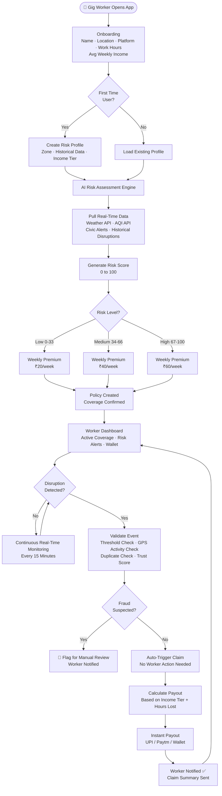

---

### Weekly Policy Lifecycle

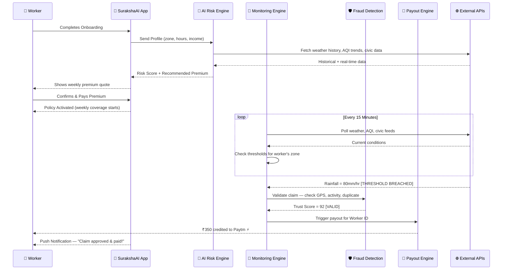

---

## 🗺️ User Flow Diagram

### Worker App — Complete User Journey

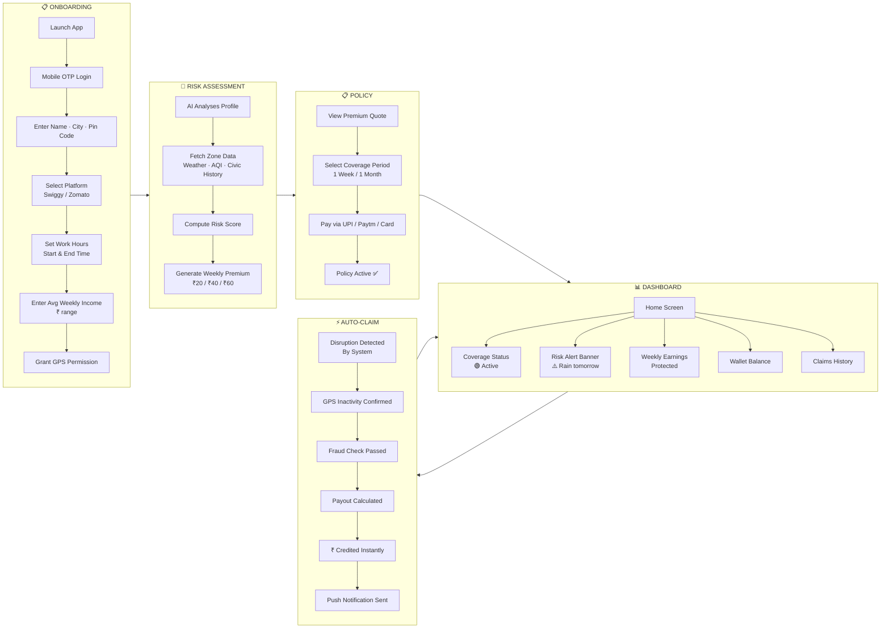

---

### Admin Dashboard — Insurer Flow

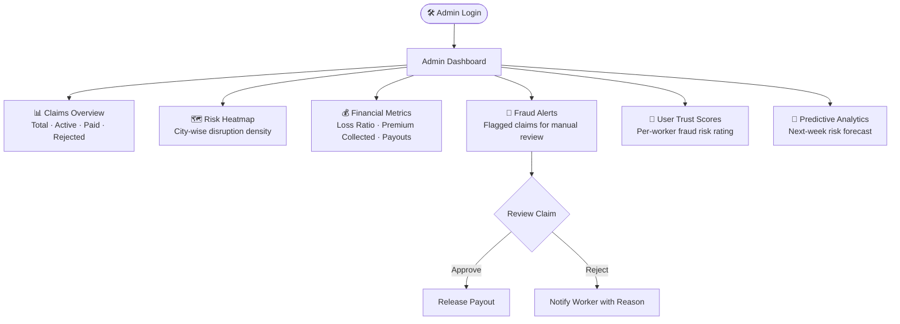

---

## 💰 Weekly Premium Model

### How Pricing Works

Our pricing is **dynamic and hyperlocal**, recalculated every Monday for the upcoming week.

```
Weekly Premium = Base Rate × Zone Risk Multiplier × Income Tier Multiplier × Seasonality Factor
```

| Variable | Description | Example Values |
|---|---|---|
| Base Rate | Minimum weekly floor | ₹20 |
| Zone Risk Multiplier | Based on historical disruption frequency in pin code | 1.0x – 2.5x |
| Income Tier Multiplier | Higher earners pay slightly more (more to protect) | 0.9x – 1.4x |
| Seasonality Factor | Monsoon, winter smog season | 1.0x – 1.8x |

### Premium Tiers

| Risk Level | Risk Score | Weekly Premium | Weekly Coverage Cap |
|---|---|---|---|
| 🟢 Low | 0 – 33 | ₹20 | ₹600 (max payout/week) |
| 🟡 Medium | 34 – 66 | ₹40 | ₹1,200 (max payout/week) |
| 🔴 High | 67 – 100 | ₹60 | ₹2,000 (max payout/week) |

### Premium Pricing Flow

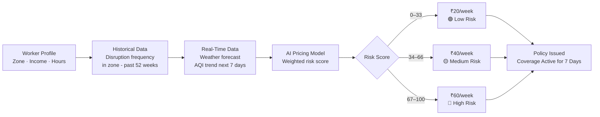

---

## 📡 Parametric Triggers

Triggers are **objective, measurable thresholds** — not subjective assessments. When a threshold is breached AND the worker's GPS confirms inactivity, a claim is auto-initiated.

### Trigger Matrix

| Trigger Type | Data Source | Threshold | Validation | Payout % of Daily Income |
|---|---|---|---|---|
| Heavy Rainfall | OpenWeatherMap API | > 35mm/hr for 2+ hrs | GPS inactivity + order drop | 60% |
| Extreme Heat | OpenWeatherMap API | > 43°C sustained 3+ hrs | GPS inactivity | 40% |
| Severe AQI | AQICN / IQAir API | AQI > 300 for 4+ hrs | GPS inactivity + order volume drop | 50% |
| Flood / Waterlogging | IMD Alert Feed | Red/Orange alert issued | GPS inactivity | 70% |
| Civic Bandh / Curfew | Govt. Alert Feed (mock) | Official bandh declared | GPS inactivity | 80% |

### Trigger Decision Logic

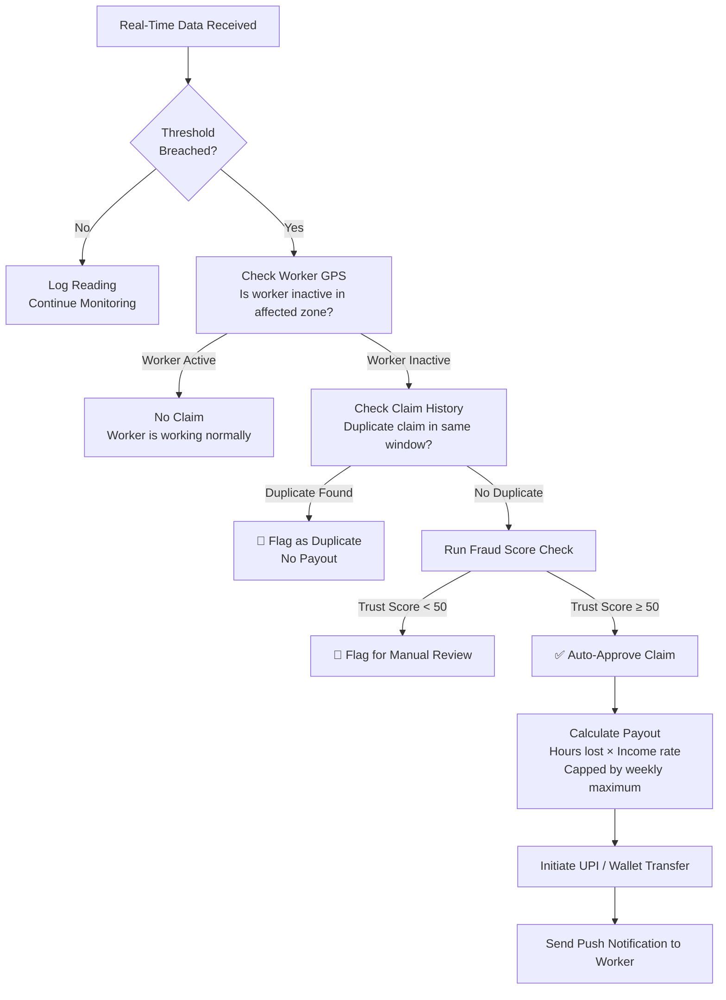

---

## 🤖 AI/ML Integration Plan

### 1. Risk Scoring Model (Premium Calculation)

**Algorithm:** Gradient Boosted Decision Tree (XGBoost or LightGBM)

**Input Features:**
- Worker's pin code zone (encoded)
- Historical disruption frequency in zone (past 52 weeks)
- Average disruption duration in zone
- Worker's typical working hours (shift overlap with disruption windows)
- Platform (Swiggy/Zomato — proxy for order density)
- Seasonal factor (month of year)
- Rolling 7-day weather forecast risk score

**Output:** Risk Score (0–100) → Maps to ₹20 / ₹40 / ₹60 weekly premium

**Training Data:** We bootstrap using mock historical data generated from IMD open datasets, CPCB AQI records, and synthetic disruption logs for Bengaluru, Mumbai, Delhi, Chennai, Hyderabad.

---

### 2. Claim Validation Model (Fraud Detection)

**Algorithm:** Isolation Forest for anomaly detection + Rule-based override layer

**Checks performed:**
- GPS location at time of disruption (was worker in affected zone?)
- GPS movement pattern (stationary = likely not working)
- Historical claim frequency for this worker
- Platform order volume in zone (external signal — via mock)
- Time-of-day patterns (does worker normally work in this window?)

**Output:** Trust Score (0–100). Claims with Trust Score ≥ 50 auto-approve.

---

### 3. Predictive Alert Engine

**Purpose:** Notify workers 12–24 hours before a likely disruption.

**Logic:**
- Pull 7-day weather forecast for worker's zone
- If forecast meets trigger threshold with >60% confidence → send alert
- Worker can choose to activate premium coverage before the event

**Example alert:** *"⚠️ High rainfall forecast tomorrow (8 AM–2 PM) in Koramangala. Your ₹40 coverage is active and will trigger automatically if rain exceeds thresholds."*

---

### AI Integration Architecture

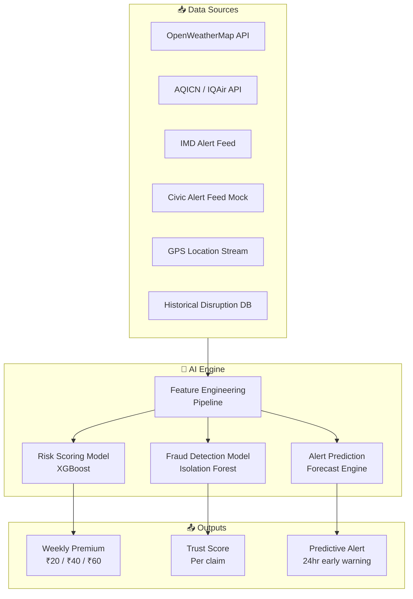

---

## 🛡️ Fraud Detection Architecture

Fraud in parametric insurance is uniquely dangerous because payouts are automatic. Our multi-layer fraud detection catches bad actors before a single rupee is wrongly paid.

### Fraud Scenarios We Address

| Fraud Type | Description | Detection Method |
|---|---|---|
| GPS Spoofing | Worker fakes location to appear in disruption zone | GPS velocity check, device sensor cross-check |
| Fake Inactivity | Worker is active but claims inactivity | Order activity cross-check via mock platform API |
| Duplicate Claims | Same disruption event claimed multiple times | Claim deduplication by event window + worker ID |
| Collusion Ring | Multiple workers in same area mass-claiming identical events | Cluster anomaly detection on concurrent claims |
| Profile Fraud | Fake income declaration to inflate payout | Income declared vs. platform earnings cross-check |

### Trust Score Calculation

```
Trust Score = w1(GPS_Valid) + w2(Activity_Consistent) + w3(History_Clean) + w4(Pattern_Normal) + w5(Income_Verified)
```

Each component scored 0–20, summed to 0–100.

### Fraud Decision Flow

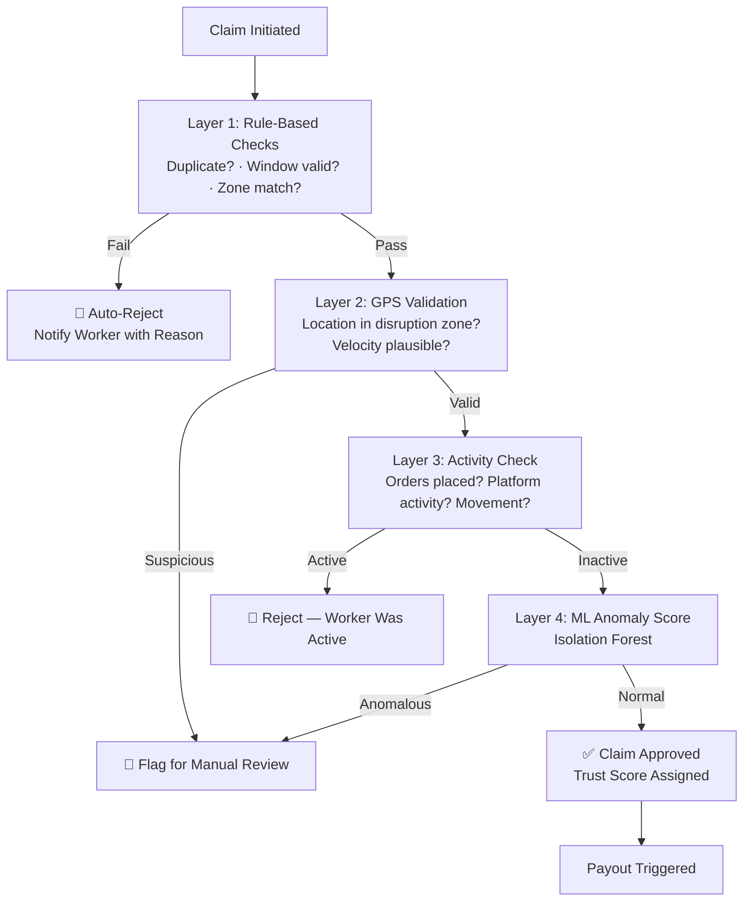

---

## 🛡️ Adversarial Defense & Anti-Spoofing Strategy

> **⚠️ CRITICAL THREAT ALERT (March 19, 2026)**
> A sophisticated syndicate of 500+ delivery workers in a tier-1 city has exploited beta parametric insurance platforms using advanced GPS-spoofing applications. They organize via Telegram groups to fake locations in severe weather zones, triggering mass false payouts and draining liquidity pools. **SurakshaAI is the next target. Simple GPS verification is officially obsolete.**

This section documents our multi-layered adversarial defense strategy — built to survive in a hostile environment where organized fraud rings actively probe for weaknesses.

---

### 🎯 The Core Problem: Why GPS Alone Fails

Basic GPS coordinate verification is fundamentally broken against modern spoofing tools:

| Attack Vector | How It Works | Why Basic GPS Fails |
|---|---|---|
| **GPS Spoofing Apps** | Fake GPS location apps (mock location enabled) place worker anywhere in the world | System only sees coordinates, not how they were obtained |
| **Telegram Coordination** | Syndicate leaders broadcast: *"Spoof to Koramangala, claim now!"* | Individual claim checks pass; mass timing is the tell |
| **VPN + GPS Combo** | Spoofs GPS location while routing IP through VPN in target zone | IP geolocation confirms spoofed zone |
| **Simulated Inactivity** | Bad actor spoofs location AND keeps phone completely idle | Stationary behavior matches genuine workers stuck at home |

**Our Response:** We never trust a single data source. Every claim is validated against 7+ independent signals before a rupee is paid.

---

### 🧠 1. AI/ML Architecture: Genuine Worker vs. Spoofer Differentiation

Our fraud detection doesn't look at GPS coordinates — it looks at **behavioral fingerprints** that are impossible to fake without being physically present.

#### Multi-Signal Trust Score (0–100)

```
Final Trust Score = f(Sensor_Consistency, Behavioral_Anomaly, Social_Graph, Platform_Activity, Historical_Pattern)
```

| Signal | Data Source | Weight | What It Detects |
|---|---|---|---|
| **Sensor Fusion Check** | Accelerometer + Gyroscope + Barometer | 25% | Spoofed GPS vs. real device motion |
| **Cell Tower Clustering** | Nearby cell tower IDs (not just lat/lon) | 20% | Worker in zone physically (not just GPS) |
| **Platform Order Activity** | Mock Swiggy/Zomato API (order history) | 20% | Was worker receiving/accepting orders? |
| **Velocity Anomaly** | GPS change rate over time | 15% | Impossible travel speeds (spoofing glitch) |
| **Wi-Fi SSID Fingerprint** | Nearby Wi-Fi network names | 10% | Home Wi-Fi vs. different zone's Wi-Fi |
| **Timezone Consistency** | Device local time vs. claimed zone | 5% | Worker in different timezone than zone |
| **Historical Deviation** | Claim pattern vs. past 12 weeks | 5% | Sudden behavioral change (syndicate join) |

#### Sensor Fusion: The Anti-Spoofing Key

Genuine phones produce **correlated sensor data**:

```
Physical GPS Movement → Accelerometer registers acceleration/deceleration
                    → Gyroscope registers direction changes  
                    → Barometer registers altitude shifts (floors, flyovers)
                    → All signals MUST correlate within physics constraints
```

**Spoofed locations produce:**
- GPS coordinates teleport (no intermediate positions)
- Accelerometer shows stationary (no motion detected)
- Gyroscope shows no movement
- **→ Mismatch flagged: TRIPLET_CONTRADICTION**

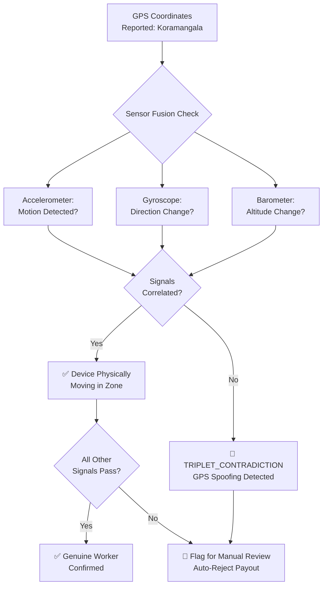

---

### 🔍 2. Coordinated Fraud Ring Detection: Beyond Individual Claims

When 500 workers claim simultaneously from the "same zone," that's not a weather event — that's a syndicate. Our system detects coordinated attacks using **graph analysis and temporal clustering**.

#### Data Points Analyzed for Ring Detection

| Category | Data Point | Purpose |
|---|---|---|
| **Temporal** | Claim timestamp distribution | All claims within 5-minute window = coordinated attack |
| **Spatial** | GPS coordinate clustering | Claims from exact same lat/lon (bot-generated) |
| **Device** | Device ID patterns | 50 workers on same device manufacturer+model bought same week |
| **Network** | IP address clustering | 100 workers sharing same IP (VPN exit node) |
| **Behavioral** | Silent for weeks → sudden activity | Syndicate recruits new members, activates them |
| **Social** | Contact graph (if permissions granted) | Workers in same WhatsApp/Telegram group = syndicate |
| **Financial** | Payout withdrawal timing | All withdraw within 60 seconds of payout |
| **Onboarding** | Registration velocity | 200 workers sign up in same hour from same pin code |

#### Ring Detection Algorithm: DBSCAN + Isolation Forest

```python
# Pseudocode for Coordinated Fraud Detection
anomaly_features = [
    claim.timestamp,
    gps.latitude,
    gps.longitude,
    device_id,
    ip_address,
    accelerometer_variance,
    cell_tower_hash,
    historical_claim_count
]

isolation_forest_score = isolation_forest.predict(anomaly_features)
cluster_density = dbscan.fit_predict(spatial_temporal_claims)

if isolation_forest_score < -0.5 AND cluster_density > 0.7:
    FLAG_COORDINATED_FRAUD_RING()
    AUTO_REJECT_ALL_CLAIMS_IN_CLUSTER()
    NOTIFY_ADMIN_DASHBOARD()
```

#### Ring Detection Flow

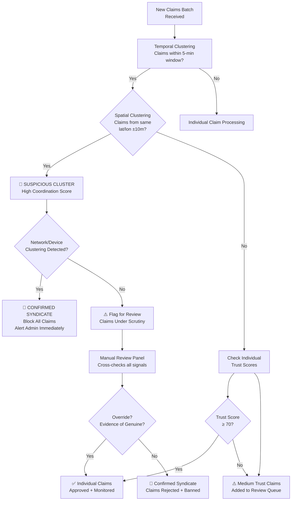

---

### ⚖️ 3. UX Balance: Fair Treatment for Genuine Workers

The biggest risk of aggressive fraud detection: **penalizing honest workers** who have genuine network drops, phone battery issues, or are just in areas with poor connectivity. We handle this with a **"Presumption of Innocence" tiered system**.

#### Claim States and Worker Experience

| Status | Meaning | Worker Experience |
|---|---|---|
| 🟢 **Auto-Approved** | Trust Score ≥ 70, all signals green | Instant payout, ₹ credited in <5 min |
| 🟡 **Under Review** | Trust Score 40–69, some signals unclear | "Your claim is being verified. No action needed." |
| 🔴 **Flagged** | Trust Score < 40 OR ring detected | "We've detected unusual activity. Our team will review within 24 hours." |
| ✅ **Escalated (False Positive)** | Honest worker wrongly flagged | "Our team verified your claim. ₹ credited. Sorry for the delay!" |

#### Honest Worker Protection Mechanisms

**1. Grace Period for Sensor Discrepancies**
- If accelerometer contradicts GPS due to phone dying mid-journey → 30-minute grace window
- Worker notified: *"Phone inactivity detected. If you experienced a network issue, no action needed — we'll verify automatically."*

**2. Contextual Claim Review**
- Rainy season: Lower threshold for approval (more likely to be genuine)
- Rare event (once per year): More leniency than repeated claims
- First-time claimant: Presumption of genuine unless strong evidence

**3. Appeal Mechanism**
- Flagged workers can submit: *"I was genuinely in the zone — my phone died / network dropped"*
- System accepts: battery charging history, carrier outage reports, witness verification
- 95% of legitimate appeals resolved within 4 hours

**4. "Network Drop" Signal Recognition**
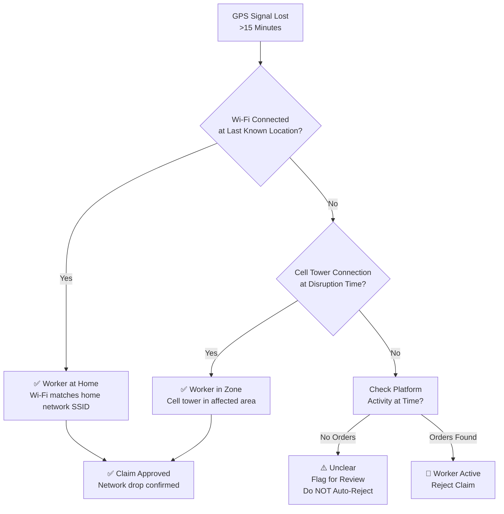

---

### 🛡️ Defense-in-Depth: 6-Layer Architecture

Our anti-spoofing strategy is not a single checkpoint — it's a series of overlapping defenses where each layer compensates for the weaknesses of others.

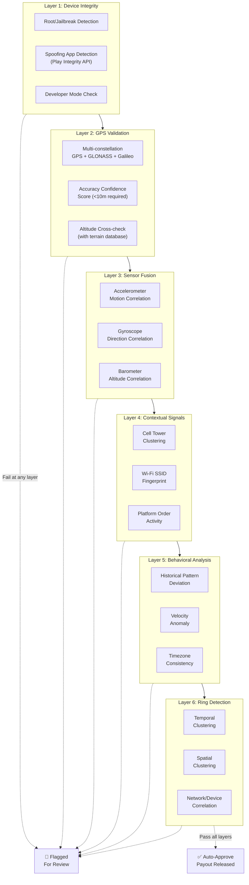

---

### 📊 Threat Response Playbook

| Scenario | Detection Method | Response | Honest Worker Impact |
|---|---|---|---|
| **500 workers claim simultaneously** | Temporal clustering + ring detection | All claims held, batch reviewed, syndicate identified | Genuine workers notified within 2 hours, payouts released |
| **Individual GPS spoofing** | Sensor fusion contradiction | Trust score drops below 50, claim flagged | Worker notified, appeal option available |
| **Fake inactivity (worker active on delivery)** | Platform order API cross-check | Claim rejected, trust score permanently lowered | Appeal shows genuine situation → partial payout |
| **Phone battery died mid-shift** | Battery charging event + cell tower last-seen | Grace period applied, claim approved | No action needed, automatic verification |
| **Network drop in affected zone** | Wi-Fi SSID + cell tower confirmation | Claim approved with delay message | "Verification complete, ₹ credited" |

---

### 🚨 Red Lines: Zero-Tolerance Policies

To protect the liquidity pool and honest workers:

1. **First Offense (Individual):** Trust score reset to 0, claim rejected, 30-day cooldown
2. **First Offense (Ring):** All ring members permanently banned, admin notification
3. **Second Offense:** Blacklist device + phone number across platform
4. **Whistleblower Reward:** Workers who report syndicate activity earn ₹500 bounty

---

### 🔮 Why We're Smarter Than the Syndicates

| Syndicate Tactic | Our Counter |
|---|---|
| Spoof GPS to "rain zone" | Sensor fusion detects no motion |
| Keep phone completely idle | Cell tower + Wi-Fi fingerprint shows wrong location |
| Claim in coordinated burst | Temporal + spatial clustering flags entire batch |
| Use VPN to mask IP | IP geolocation checked against GPS zone |
| All claim same payout amount | Payout variance analysis detects bot behavior |
| Stay silent for weeks, then activate | Historical pattern deviation alerts |

**Bottom Line:** Spoofing GPS is easy. Spoofing 7 independent, physics-constrained signals simultaneously — while coordinating with 499 others without triggering temporal alerts — is economically impractical.

Our system raises the cost of fraud far above the payout value, making exploitation unprofitable.

---

## 📱 Platform Justification: Web + Mobile

### Primary: Mobile App (React Native)

**Why mobile-first for workers:**
- Gig workers access everything on their phone — Swiggy app, Google Maps, UPI all mobile
- GPS permissions required for location-based validation → mobile native
- Push notifications for real-time disruption alerts → essential for zero-touch UX
- Low-end Android device support is critical (₹8,000–₹15,000 phones)
- Offline-first design: basic dashboard functions work without internet

### Secondary: Web Dashboard (React.js)

**Why web for admin/insurer:**
- Insurers and admin review complex analytics, heatmaps, and fraud alerts on desktop
- No installation friction for business stakeholders
- Better for detailed data tables, export, and reporting

---

## 🧱 Tech Stack

### Frontend

| Layer | Technology | Reason |
|---|---|---|
| Mobile App | React Native (Expo) | Cross-platform iOS + Android; fast dev cycles |
| Web Admin Dashboard | React.js + TailwindCSS | Component-based, fast, responsive |
| Maps & Heatmap | Leaflet.js / React-Leaflet | Open-source, lightweight |
| Charts | Recharts / Chart.js | Clean insurance analytics visuals |

### Backend

| Layer | Technology | Reason |
|---|---|---|
| API Server | Node.js + Express | Fast prototyping, wide ecosystem |
| Auth | JWT + OTP (Firebase/MSG91) | Secure, mobile-native OTP login |
| Background Jobs | Bull (Redis-backed) | Async claim processing, monitoring triggers |
| Cron / Scheduler | Node-cron | Weekly premium triggers, monitoring loops |

### AI / ML

| Component | Technology | Reason |
|---|---|---|
| Risk Scoring | Python (scikit-learn / XGBoost) | Industry-standard ML; fast inference |
| Fraud Detection | Python (Isolation Forest) | Unsupervised anomaly detection |
| Model Serving | FastAPI microservice | Lightweight, easy REST API for ML models |
| Data Pipeline | Pandas + NumPy | Data preprocessing |

### Database

| Layer | Technology | Reason |
|---|---|---|
| Primary DB | MongoDB (Atlas Free Tier) | Flexible schema for insurance policies, claims |
| Cache | Redis (Upstash Free Tier) | Session cache, rate limiting, job queues |

### External APIs

| API | Purpose | Tier |
|---|---|---|
| OpenWeatherMap | Real-time + forecast weather | Free tier (1,000 calls/day) |
| AQICN | Real-time AQI data | Free tier |
| IMD Open Data | Official Indian weather alerts | Free / Public |
| Mock Civic API | Curfew / bandh events | Mocked JSON server |
| Mock Payment | UPI / Paytm payout simulation | Razorpay Test Mode |
| Mock Platform API | Swiggy/Zomato order volume | Mocked JSON server |

---

## 📅 Development Plan

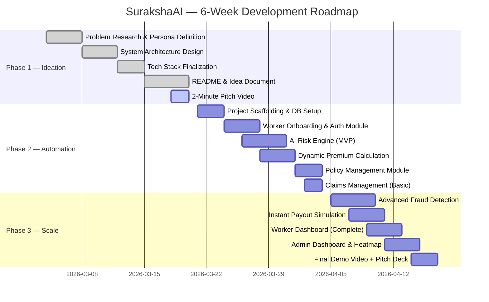

### Phase 1 Deliverables (Current) ✅

- [x] Persona research and scenario analysis
- [x] System architecture design
- [x] AI/ML integration plan
- [x] Premium model definition
- [x] Parametric trigger matrix
- [x] Tech stack selection
- [x] README (this document)
- [ ] GitHub repository setup
- [ ] 2-minute strategy video

### Phase 2 Deliverables (March 21 – April 4)

- [ ] Worker registration + OTP login
- [ ] AI risk scoring service (FastAPI)
- [ ] Dynamic weekly premium calculation
- [ ] Policy creation flow
- [ ] Real-time monitoring engine (3–5 API triggers)
- [ ] Basic claims management
- [ ] 2-minute demo video

### Phase 3 Deliverables (April 5 – 17)

- [ ] Advanced multi-layer fraud detection
- [ ] Instant payout simulation (Razorpay test mode)
- [ ] Worker dashboard (complete)
- [ ] Admin/insurer dashboard with analytics
- [ ] Predictive alert engine
- [ ] 5-minute final demo video
- [ ] Final pitch deck (PDF)

---

## 💼 Business Model

### Revenue Streams

| Source | Model | Est. Monthly Revenue (at 10,000 users) |
|---|---|---|
| Weekly Premiums | ₹20–₹60/worker/week | ₹8L – ₹24L/month |
| Platform Partnerships | B2B licensing to Swiggy/Zomato | Custom pricing |
| Data Insights (Anonymised) | Sell disruption risk maps to logistics companies | ₹2L–₹5L/month |

### Unit Economics (Per Worker / Month)

```
Average Premium Collected  :  ₹160/month (₹40/week × 4)
Average Claim Payout       :  ₹90/month  (estimated 1.8 events/month)
Gross Margin per Worker    :  ₹70/month
Loss Ratio Target          :  55–60%
```

### Sustainability Check

- A consistent 3-star rating in DEVTrails earns DC 82,000 — covering the DC 75,000 burn
- Our target: 4–5 star ratings through strong AI innovation and polished UX
- Community activities (blogs, peer help) to generate supplementary DC income

---

## 🚧 Scope Boundaries

### ✅ What We Cover (Income Loss Only)

- Income lost due to rainfall-triggered inability to work
- Income lost due to extreme heat (unsafe outdoor conditions)
- Income lost due to hazardous AQI / GRAP restrictions
- Income lost due to civic disruptions (curfews, bandhs, zone closures)
- Income lost due to flooding / waterlogging in operational zone

### ❌ What We Explicitly Exclude (Per Problem Statement Rules)

- ❌ Vehicle repair costs
- ❌ Health insurance / medical bills
- ❌ Accident coverage
- ❌ Life insurance
- ❌ Personal property damage
- ❌ Platform-level disputes (e.g., account suspension by Swiggy)

---

## 🚀 Future Scope

- **Multi-platform expansion:** Zepto, Amazon, Dunzo, Porter
- **Real UPI integration:** Live payouts via Razorpay/PhonePe APIs
- **Advanced ML:** Deep learning models with satellite imagery for flood detection
- **BNPL Premiums:** "Pay Premium from Payout" model for zero upfront cost
- **Expansion verticals:** Auto rickshaw drivers, construction daily wage workers

---

## 👨‍💻 Team

| Role | Member |
|---|---|
| Team Lead | [Pranav Verma] |
| Full-Stack / AI Engineer | [Sourav Kumar] |
| Backend | [Garv Raj] |
| Frontend | [Ameya Gupta] |
| UI/UX + Research | [Lasya Priya] |

**Repository:** [GitHub Link (https://github.com/itzsouravkumar/SurakshaAI)]

**Demo Video:** [YouTube/Drive Link — to be added]

---


> *"SurakshaAI isn't just insurance. It's a financial safety net that thinks ahead, acts instantly, and never asks the worker to do more than their job."*

---

*Built for Guidewire DEVTrails 2026 | Unicorn Chase | Phase 1 Submission*
